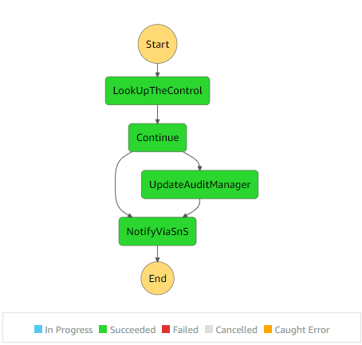

# AWS Audit Manager Manual Evidence Automation

## Background 

Organizations in regulated industries must balance regulatory compliance and audit processes with their accelerated software delivery capabilities. AWS Audit Manager supports this effort by automatically collecting evidence and enabling regular assessments of AWS Account configurations. Data can be automatically collected from AWS Config, AWS Security Hub, AWS CloudTrail and via API calls from AWS services. In addition to this automatically collected data, the assessments and their accompanying reports can be augmented with manually uploaded evidence.

Examples of this manual evidence include, but are not limited to:

1. SDLC approval process documentation
1. Change control records
1. Regulatory process changes

In a typical scenario, customers may want to perform additional actions after evidence has been uploaded. These actions could include tieing the evidence to a control in an assessment, running a task to analyze/validate the file, or performing additional processing on the file. 

This solution provides a sample integration method to connect a desired DevSecOps process with tools available in AWS Audit Manager. It assumes that you have already configured AWS Audit Manager and have created assessments.


## How this Solution Works

This sample solution uses AWS Step Functions to orchestrate updates to AWS Audit Manager.

The AWS Step Function State Machine:



- The state machine takes the following input:
    - Assessment Name
    - Control Set Name
    - Control Name
    - Valid S3 object path where additional evidence resides

- If the control is found, the Step Function will update Audit Manager with the additional evidence
- Sends a notification via Amazon Simple Notification Service
    - Notification on Success or Failure
    - Allows connecting to other systems

This solution creates an HTTPS API Endpoint to allow integration with other Software Delivery Lifecycle solutions or ITSM products. The provided implementation can be extended to support various webhooks. 


Example invocation for an assessment named `GxP21cfr11` via curl:  

```
curl --location --request POST 'https://<YOURAPIENDPOINT>.execute-api.<AWS REGION>.amazonaws.com/Prod' \
--header 'x-api-key: <API KEY>' \
--form 'payload=@"<PATH TO FILE>"' \
--form 'AssessmentName="GxP21cfr11"' \
--form 'ControlSetName="General requirements"' \
--form 'ControlIdName="11.100(a)"'
```

1. This API uses an (`x-api-key`) to track usage
    1. The API key is used to track and control usage by clients
    2. To truly secure this endpoint consider using IAM authentication described in a later section.
1. The from post content:
    - AssessmentName : Name for the assessment in the Audit Manager GUI, `GxP21cfr11` as an example
    - ControlSetName : Display name for a control set within an assessment, `General requirements` as an example
    - ControlIdName : A particular control within a control set `11.100(a)` as an examples
    - payload : file content


The file contents will be placed in the S3 bucket in a folder that matches the assessment name, the file name is pre-pended with a UUID to prevent collisions. 

#### IAM Protect API Gateway

You can additionally protect this solution by using AWS IAM authentication/authorization for invoking the API Gateway. This is enabled by a overriding the default parameters ( `paramUseIAMwithGateway`) at deployment time. You can read about this capability [here](https://aws.amazon.com/premiumsupport/knowledge-center/iam-authentication-api-gateway/) and [here](https://docs.aws.amazon.com/apigateway/latest/developerguide/permissions.html).  This solution also deploy an example managed policy to attach to roles/groups/users if needed. 

## Build and Deploy Sample Solution

This project contains source code and supporting files for a serverless application that you can deploy with the AWS Serverless Application Model (AWS SAM) command line interface (CLI). It includes the following files and folders:

- `src` - Code for the application's Lambda implementation of Step Functions. Also includes a step function definition file.
- `template.yml` - A template that defines the application's AWS resources.

Resources for this project are defined in the `template.yml` file in this project. You can update the template to add AWS resources through the same deployment process that updates your application code.


### Pre-requisites

The AWS SAM CLI is an extension of the AWS CLI that adds functionality for building and testing Lambda applications. It uses Docker to run your functions in an Amazon Linux environment that matches Lambda. It can also emulate your application's build environment and API.

To use the AWS SAM CLI, you need the following tools:

* AWS SAM CLI - [Install the AWS SAM CLI](https://docs.aws.amazon.com/serverless-application-model/latest/developerguide/serverless-sam-cli-install.html).
* Node.js - [Install Node.js 14](https://nodejs.org/en/), including the npm package management tool.
* Docker - [Install Docker community edition](https://hub.docker.com/search/?type=edition&offering=community).


### First Time Build and Deploy

To build and deploy your application for the first time, run the following in your AWS SAM shell. **You will need a unique S3 Bucketname. This solution will create the bucket**

```
sam build
sam deploy --guided --parameter-overrides paramBucketName=[A unique none existent bucketname]
```

The first command will build the source of your application. The second command will package and deploy your application to AWS, with a series of prompts. For the prompts, use the region where AWS Audit Manager was configured. Use other default values. 

To activate the IAM authentication feature for API gateway, override the default value with the following:
```
paramUseIAMwithGateway=AWS_IAM
```

## Clean Up

To clean up
- Delete content in S3 Bucket
- Delete the CloudFormation stack associated with this solution

